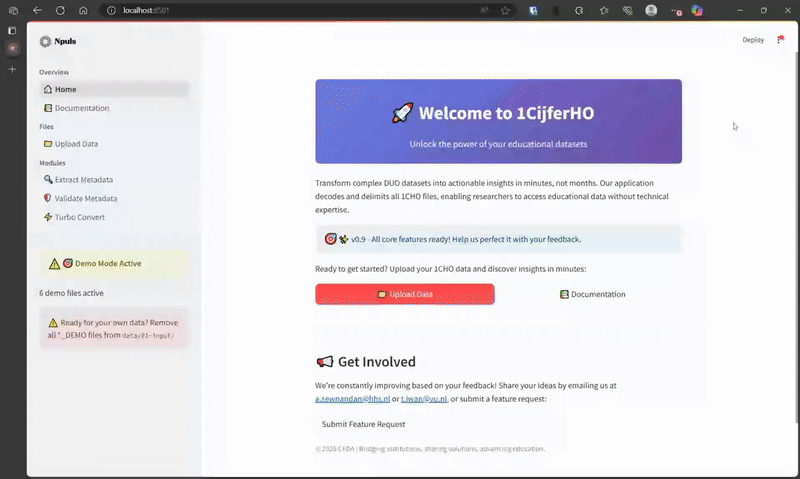

<div align="center">
  <h1>1CijferHO Tool</h1>

  <p>Maak 1cijferHO-data direct bruikbaar voor analyse en onderzoek</p>

  <p>
    <a href="#"></a>
    <a href="#"></a>
    <a href="#"></a>
    
    
    
  </p>

</div>

## Wat is het?

De 1CijferHO Tool automatiseert het verwerken van 1cijferHO-data, zoals:
- **ASCII-bestanden** zonder duidelijke scheiding tussen velden.
- **Metadata-bestanden** in ongestructureerde .txt-indeling.

Met deze tool kun je in enkele minuten grote hoeveelheden data verwerken, zonder risico op fouten of verlies van gegevens.

> ℹ️ Benieuwd wat er op de planning staat? Bekijk de [roadmap](ROADMAP.md).


### 📑 Congrespresentatie(s)

Tijdens de DAIR-conferentie in 2025 hebben we de 1CijferHO Tool gepresenteerd. Bekijk de slides van de presentatie hieronder:

[📂 Presentatie DAIR 2025](presentatie-DAIR-2025.pdf)


## Waarom is dit belangrijk?

1cijferHO-data is essentieel voor beleidsvorming en onderzoek, maar het handmatig verwerken ervan kost veel tijd en brengt risico’s met zich mee. De 1CijferHO Tool biedt een oplossing die:
- **Tijd bespaart**: Verwerk gigabytes aan data in enkele minuten.
- **Betrouwbaar is**: Voorkomt fouten door automatische validatie.
- **Veilig werkt**: Anonimiseert gevoelige gegevens, zoals BSN’s.
- **Gebruiksklaar**: Levert schone CSV- of Parquet-bestanden voor directe analyse.


## Hoe werkt het?

1. **Start de tool** met één eenvoudige opdracht.
2. **Upload je bestanden** (data en metadata).
3. **Bekijk de resultaten**: Je krijgt direct schone, geoptimaliseerde bestanden.


## Aan de slag

### Stap 1: Download de tool
Je kunt de tool downloaden via GitHub:
- [Download ZIP-bestand](https://github.com/cedanl/1cijferho/archive/refs/heads/main.zip)
- Of gebruik Git:  
  ```bash
  git clone https://github.com/cedanl/1cijferho.git
  ```

### Stap 2: Installeer de tool
Voor installatie-instructies, zie de [Technische README](TECHNICAL_README.md).

### Stap 3: Start de applicatie
Open een terminal in de map waar je de tool hebt opgeslagen en voer het volgende commando uit:
```bash
uv run streamlit run src/main.py
```
De applicatie opent automatisch in je browser.


## 🎬 Demo Video

Bekijk hieronder een korte demonstratie van hoe de 1CijferHO Tool werkt:




## 🫂 Bijdragers

Dank aan alle mensen die hebben bijgedragen aan de ontwikkeling van de 1CijferHO Tool:

[](https://github.com/asewnandan)
[](https://github.com/tin900)
[](https://github.com/Tomeriko96)

